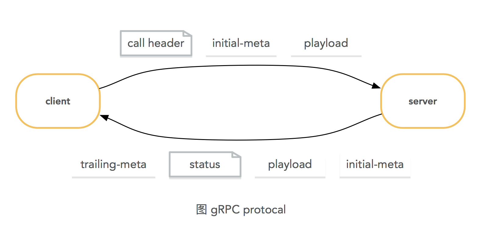

# gRPC

[Reference link](https://github.com/grpc/grpc)

## Introduction

gRPC is a modern, open source, high-performance **remote procedure call (RPC) framework**.

gRPC can run anywhere, there are  **gRPC libraries for multiple languages** written on top of shared C core library [src/core](https://github.com/grpc/grpc/blob/master/src/core). 

You can find **per-language quickstart guides and tutorials** in [Documentation section on grpc.io website](https://grpc.io/docs/). The code examples are available in the [examples](https://github.com/grpc/grpc/blob/master/examples) directory.

## Troubleshooting

Sometimes things go wrong. Please check out this guide if you are experiencing issues with gRPC.

This guide is for troubleshooting gRPC implementations based on C core library.

### Enabling extra logging and tracing

All gRPC implementations based on C core library support the `GRPC_VERBOSITY` and `GRPC_TRACE` environment variables that can be used to increase the amount of information that gets printed to stderr.

> `GRPC_VERBOSITY` is used to set the minimum level of log messages printed by gRPC (supported values are `DEBUG`, `INFO`and `ERROR`). If this environment variable is unset, only `ERROR` logs will be printed.
>
> `GRPC_TRACE` can be used to enable extra logging for some internal gRPC components.​ 

```shell
# Enable debug logs for an application
GRPC_VERBOSITY=debug ./helloworld_application_using_grpc
```

```shell
# Print information about invocations of low-level C core API.
# Note that trace logs of log level DEBUG won't be displayed.
# Also note that most tracers user log level INFO, so without setting
# GPRC_VERBOSITY accordingly, no traces will be printed.
GRPC_VERBOSITY=info GRPC_TRACE=api ./helloworld_application_using_grpc
```

```shell
# Print info from 3 different tracers, including tracing logs with log level DEBUG
GRPC_VERBOSITY=debug GRPC_TRACE=tcp,http,api ./helloworld_application_using_grpc
```

## Performance

Q: How to profile grpc's performance?

## Concepts

**Remote Procedure Calls (RPCs) provide a useful abstraction** for building distributed applications and services. The libraries in [grpc/**grpc**](https://github.com/grpc) repository provide a **concrete implementation of the gRPC protocol**, **layered over HTTP/2**. These libraries enable communication between clients and servers using any combination of the supported languages.

Developers using gRPC start with a language agnostic description of an RPC service. The server implements the service interface, which can be remotely invoked by the client interface.

By default, gRPC uses [Protocol Buffers](https://github.com/google/protobuf) as the **Interface Definition Language (IDL)** for describing both the service interface and the structure of the payload messages. It is possible to use other alternatives if desired.

**Starting from an interface definition in a .proto file**, gRPC provides Protocol Compiler plugins that generate Client- and Server-side APIs. gRPC users call into these APIs on the Client side and implement the corresponding API on the server side.

On the other hand, **networks are inherently asynchronous** and in many scenarios, it is desirable to have the ability to start RPCs without blocking the current thread.

**gRPC supports streaming semantics**, where either the client or the server (or both) send a stream of messages on a single RPC call. **The most general case is Bidirectional Streaming** where a single gRPC call establishes a stream in which both the client and the server can send a stream of messages to each other. The streamed messages are delivered in the order they were sent.

A gRPC call comprises of a bidirectional stream of messages, initiated by the client.  In the client-to-server direction, this stream begins with a mandatory `Call Header`, followed by optional `Initial-Metadata`, followed by zero or more `Payload Messages`. The server-to-client direction contains an optional `Initial-Metadata`, followed by zero or more `Payload Messages` terminated with a mandatory `Status` and optional `Status-Metadata` (a.k.a.,`Trailing-Metadata`).



gRPC bidirectional streams are mapped to HTTP/2 streams.

The contents of `Call Header` and `Initial Metadata` are sent as HTTP/2 headers and subject to HPACK compression. `Payload Messages` are serialized into a byte stream of length prefixed **gRPC frames** which are then fragmented into HTTP/2 frames at the sender and reassembled at the receiver. `Status` and `Trailing-Metadata` are sent as HTTP/2 trailing headers.
