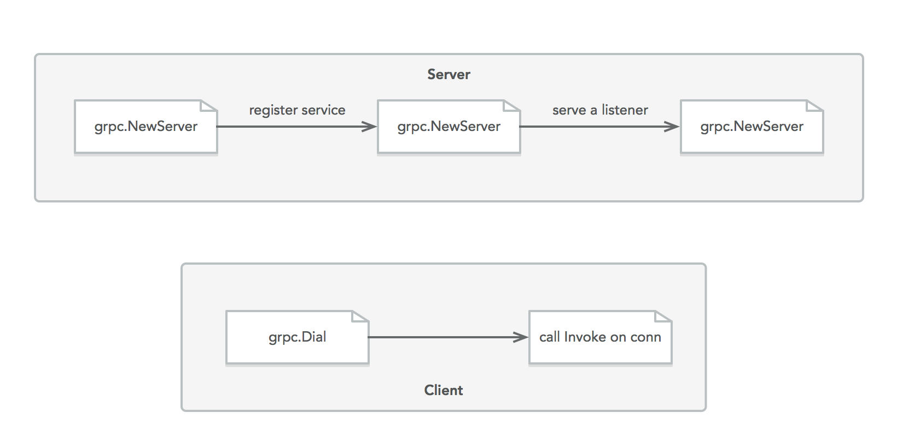

# Server

1. get a *listener*
2. get a rpc server
3. register server description and service implement for rpc server
4. rpc *server* serve at the *listener*

# Client

1. establish a *connection* to server
2. call Invoke on this *connection*

