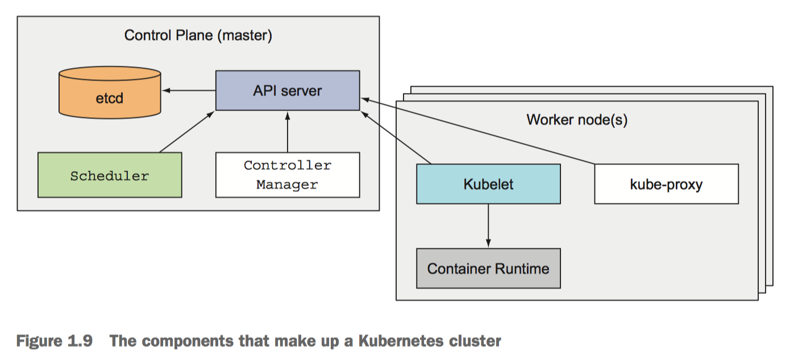

# Architecture of a Kubernetes cluster

At the hardware level, a Kubernetes cluster is composed of many nodes, which can be split into two types:

* The master node, which hosts the Kubernetes Control Plane that controls and manages the whole Kubernetes system
* Worker nodes that run the actual applications you deploy

## THE CONTROL PLANE

The Control Plane is what **controls the cluster** and makes it function. It consists of multiple components that can run on a single master node or be split across multiple nodes and replicated to ensure high availability. These components are:

> * The Kubernetes API Server, which you and the other Control Plane components **communicate with**
>
> * The Scheduler **schedules your apps**
> * The Controller Manager, which **performs cluster-level functions**, such as replicating components, keeping track of worker nodes, handling node failures, and so on
> * etcd, a reliable distributed data store  that persistently **stores the cluster configuration**.

The components of the Control Plane hold and control the state of the cluster, but they don’t run your applications. This is done by the (worker) nodes.

## THE NODES

The worker nodes are the machines that run your **containerized applications**. The task of running, monitoring, and providing services to your applications is done by the following components:

> * Docker, rkt, or another **container runtime**, which runs your containers
> * The Kubelet, which **talks to the API server and manages containers** on its node
> * The Kubernetes Service Proxy (kube-proxy), which load-balances **network traffic** between application components

***
1. From ***Kubernetes in Action***
