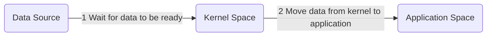
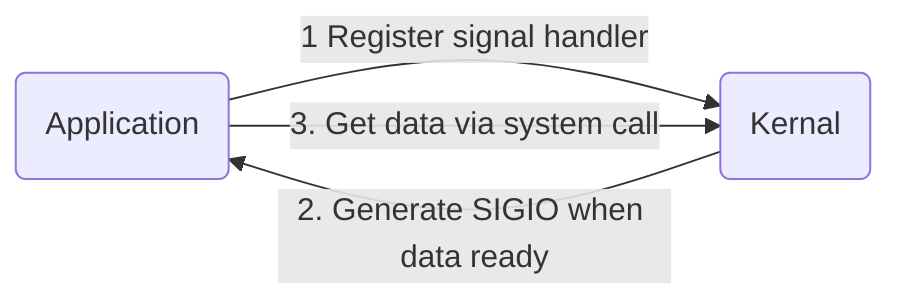

# IO Models

Under Unix, there are **5** I/O models:

- blocking I/O
- nonblocking I/O
- I/O multiplexing
  - select
  - poll
- signal driven I/O
  - SIGIO
- asynchronous I/O
  - POSIX aio_

Two phase for input operation:

## 1. Blocking I/O Model

- `the most prevalent` I/O model
- `By default`, all sockets are `blocking`.
- `recvfrom` is implemented different on different platfrom.
  - system call on BSD
  - function on System V
- As to `system call`, there is normally a `switch` between userspace and kernel.
- With Blocking I/O, system call return when:
  - success
    - data copied to application space
  - error
    - interrupted by signal (most common)
    - others
- Process `blocked` when calling these kind of system call.

## 2. NonBlocking I/O Model

- when set a socket to be nonblocking
- Instead block the process, system call would return error `EWOULDBLOCK`
- [ ] blocking I/O is described detailed within Chapter 16

- call system call `on nonblocking file descriptor`

## 3. I/O Multiplexing Model

- via `select` or `poll`
- block on these other system calls
  - `instead of` blocking `in the actual` I/O system call
- Prons
  - can `wait for more than one` descripter to be ready
- Cons
  - Using `select` requires two system call
- Another similar solution:
  - multithreading with blocking I/O

## 4. Signal-Driven I/O Model

- Application do not block while waiting for data

## 5. Asynchronous I/O Model

- Defined by POSIX specification
  - reconcile different `real-time` function
- Similar with signal-driven I/O model, but the difference is:
  - With asynchronous I/O, kernel notify application when data is ready
  - With Signal-Driven I/O, after kernel's notification, application would have to fetch data via system call

## 6. Comparison

- The first phase is the same for the first four I/O models.
- The first four I/O models are the same at the second phase.
- Asynchronous I/O models handle the first and the second phase.

---

1. Referenc <[PEARSON] UNIX Network Programming (Volume 1 Third Edition)>